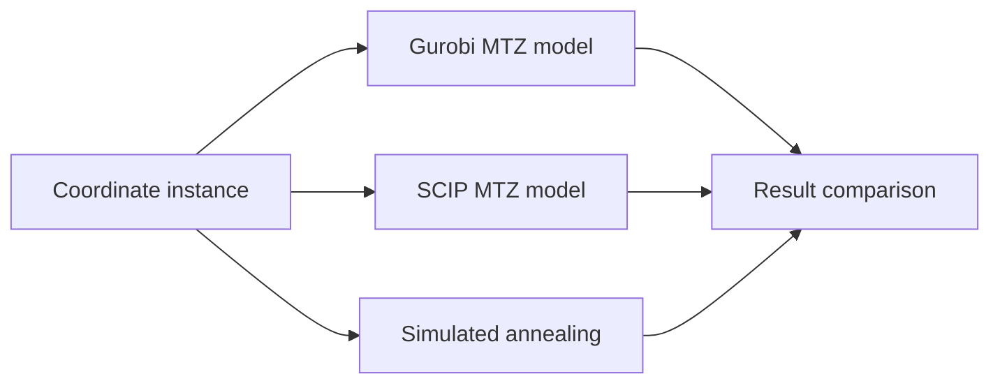

# TSP Solver Benchmark

A compact Python benchmark for the Traveling Salesperson Problem (TSP), comparing exact MIP formulations in Gurobi and SCIP with a simulated-annealing heuristic.

## Overview

The project uses the same coordinate instance for three solver paths and reports route length, runtime, objective value, and MIP gap when the exact solvers find a solution. It is intended as a small, inspectable example of the trade-off between exact optimization and metaheuristic search.

## Methods

### Exact solvers

- **Gurobi:** binary arc variables with MTZ subtour-elimination constraints.
- **SCIP:** an equivalent MTZ-style formulation built with PySCIPOpt.

### Simulated Annealing

The heuristic starts from a random permutation, evaluates the closed tour length, and applies two-city or three-city **swap moves** under a temperature-based acceptance rule. These moves are not presented as canonical 2-opt or 3-opt edge reconnections.

## Algorithm Flow



## Outputs

`main.py` prints a comparison table with solution distance, runtime, objective value, and available MIP-gap information. `visual.py` renders the tours side by side during execution.

No persistent benchmark table or rendered figure is currently tracked in the repository, so this README intentionally makes no claim about solution quality, speed, or scalability beyond the code path itself.

## Quick Start

Requires a working Gurobi installation/license and a local SCIP/PySCIPOpt installation.

```bash
python -m pip install -r requirements.txt
python main.py
```

To use another instance, replace the coordinate list loaded by `TSPData` in `data.py`.

## Repository Structure

```text
data.py         # coordinate data and distance matrix
Tsp_Gurobi.py   # Gurobi MTZ solver
Tsp_SCIP.py     # SCIP MTZ solver
Tsp_SA.py       # simulated annealing with swap moves
visual.py        # route-comparison plots
main.py          # benchmark entry point
```

## License

No license has been added yet. Do not reuse or redistribute the code until a license is explicitly provided.
